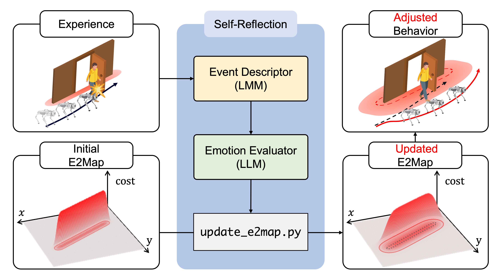

# E2Map: Experience-and-Emotion Map for Self-Reflective Robot Navigation with Language Models

#### [[Project Page]](https://e2map.github.io/) [[Paper]](https://www.arxiv.org/abs/2409.10027) 

[Chan Kim](https://sites.google.com/snu.ac.kr/chankim)<sup>*1</sup>, [Keonwoo Kim](https://www.notion.so/Keonwoo-Kim-743fdb8532e34542bca4172790183849?pvs=4)<sup>*1</sup>, Mintaek Oh<sup>1</sup>, Hanbi Baek<sup>1</sup>, Jiyang Lee<sup>1</sup>, [Donghwi Jung](https://donghwijung.github.io/)<sup>1</sup>, [Soojin Woo](https://woo-soojin.github.io/)<sup>1</sup>, Younkyung Woo<sup>2</sup>, [John Tucker](https://msl.stanford.edu/people/johntucker)<sup>3</sup>, [Roya Firoozi](https://sites.google.com/view/royafiroozi/home)<sup>3</sup>, [Seung-Woo Seo](https://ece.snu.ac.kr/en/research-faculty/faculty/fulltime?md=view&profid=p022)<sup>1</sup>, [Mac Shwager](https://web.stanford.edu/~schwager/)<sup>3</sup>, [Seong-Woo Kim](https://arisnu.squarespace.com/director)<sup>1</sup>

(*Indicates equal contribution)


<sup>1</sup>Seoul National University, <sup>2</sup>Carnegie Mellon University, <sup>3</sup>Stanford University

<p align="center">
  
</p>

We present E2Map (Experience-and-Emotion Map), a spatial map that captures the agent's emotional responses to its experiences. Our method enables one-shot behavior adjustments in stochastic environments by updating the E2Map through the diverse capabilities of LLMs and LMM.

## System Overview
<p align="center">
  
</p>

## Table of Contents
- [Requirements](#requirements)
- [Setup](#requirements)
- [Prerequisite Materials](#prerequisite-materials)
  - [Downloading Simulated Testbed Files](#downloading-simulated-testbed-Files)
  - [Running Gazebo World](#running-gazebo-world)
- [E2Map: Experience-and-Emotion Map](#e2map-experience-and-emotion-map)
  - [Adjusting Behavior with E2Map](#adjusting-behavior-with-e2map)
  - [Navigating with Custom User Instruction](#navigating-with-custom-user-instruction)
- [Experimental Setup](#experimental-setup)
  - [Scenarios](#scenarios)
  - [Simulation Experiment](#simulation-experiment)
- [Other Components](#other-components)
  - [Subgoal Coordinate Filter](#subgoal-coordinate-filter)
  - [LLM-based Goal Selector](#llm-based-goal-selector)
- [Citation](#citation)

## Requirements
- Anaconda or Miniconda
- CUDA 11.8 or 12.1
- ROS (Only tested in ROS Noetic, Ubuntu 20.04)

## Setup
### Cloning the Repository
```bash
git clone https://github.com/knwoo/e2map
```
### Setting Conda Environment
```bash
cd <path to repository>
conda env create -f env.yml
conda activate e2map
```

### Setting ROS Workspace
To execute related ROS commands,  
```bash
cd <path to repository>
catkin_make
source devel/setup.bash
```

### Installing Pre-trained LSeg Model
Download LSeg checkpoint with [this link](https://drive.usercontent.google.com/download?id=1ayk6NXURI_vIPlym16f_RG3ffxBWHxvb&authuser=1),
```bash
cd <path to repository>/src/models/lseg/
mkdir checkpoints
```
and put `demo_e200.ckpt` under `checkpoints/`. 

## Prerequisite Materials
There are a few steps to follow to reproduce our simulated environment.

### Downloading Simulated Testbed Files
We created a real-world mirrored simulation environment of the conference room using the ROS Gazebo simulator.
<p align="center">
  
</p>

#### 1. Download pre-built maps
  If you want to build the visual-language feature map for your own Gazebo indoor testbed, please refer [VLMaps official repository](https://github.com/vlmaps/vlmaps).
   
   Pre-built maps are used for planning and grounding landmarks. Download maps of our testbed from [this link](https://drive.google.com/file/d/1F-OBKUknezTBUBQsdPSWkMSvZhNj5-DL/view?usp=drive_link). Then follow the below commands:
   ```bash
   cd <path to repository>/src/e2map
   mkdir -p data/maps
   ```
   Unzip `room_209.zip` and put the maps under `<path to repository>/src/e2map/data/maps`.

   You can easily unzip via `unzip <path to home directory>/Downloads/room_209.zip -d <path to repository>/src/e2map/data/maps`. 

#### 2. Download mesh

   - [High resolution (raw)](https://drive.google.com/file/d/13_vC8QZMEG0pHHVjHvPFi-Yd2xvtkNS3/view?usp=sharing)
   - [Low resolution ](https://drive.google.com/file/d/10iSn82IVvI_Wq76mw-ZtAQdA59hCR0Gf/view?usp=sharing)

   Locate `209.dae` under `<path to repository>/src/environment/models/209/meshes/`

#### 3. Download texture file
   
   - [Texture](https://drive.google.com/file/d/1a0dp3MZHVsyE3Tn6OrTq3F3uB5uDPXk7/view?usp=drivesdk)

   Locate `209_texture.png` under `<path to repository>/src/environment/models/209/materials/textures/`

#### 4. Install dependencies and set environmental variables

   To successfully interact with the quadruped robot, you should install additional Debian packages.
   ```bash
   sudo apt update
   sudo apt install liblcm-dev
   sudo apt install ros-noetic-controller-interface ros-noetic-gazebo-ros-pkgs ros-noetic-gazebo-ros-control ros-noetic-joint-state-controller ros-noetic-effort-controllers ros-noetic-joint-trajectory-controller
   ```
   Then, export the environment variable to successfully load the downloaded model of our testbed to the Gazebo simulator.
   ```bash
   export GAZEBO_MODEL_PATH=$GAZEBO_MODEL_PATH:<path to repository>/src/environment/models

   # ex) export GAZEBO_MODEL_PATH=$GAZEBO_MODEL_PATH:/home/knwoo/e2map/src/environment/models
   ```

### Running Gazebo World
After following [previous steps](#downloading-simulated-testbed-files), run the following launch file to load the simulated environment.
```bash
roslaunch unitree_gazebo go1_209.launch
```

In another terminal, you can spawn a quadruped robot in the simulator by running the following command.
```bash
roslaunch unitree_guide go1_spawner.launch
```
- If Go1 flips after spawning, increase `/stand_wait_count` in the `go1_spawner.launch`.

- If Go1 sinks after spawning, increase `/move_base_wait_count` in the `go1_spawner.launch`.

To control the quadruped robot, run the following command in another terminal.
```bash
roslaunch test_zone teleop_key.launch
```

To remove the quadruped robot, run the following command in another terminal.
```bash
rosservice call gazebo/delete_model '{model_name: go1_gazebo}'
```

To respawn the robot, kill the terminal which launched `go1_spawner.launch` and run the `roslaunch unitree_guide go1_spawner.launch` again.


## E2Map: Experience-and-Emotion Map

In this section, we provide two guidelines: 
  1.  __Adjusting Behavior with E2Map__: How to prepare to use E2Map for implementing self-reflective navigation agent.
  2.  __Navigating with Custom User Instruction__: How to run language navigation with custom user instruction. 


### Adjusting Behavior with E2Map
If you want to run language navigation without E2Map, go  to [Navigation with Custom User Instructon](#navigating-with-custom-user-instruction) directly.  

#### 1. Select workstation

   Put the whole `<path to repository>/src/foundations/e2map_update>` directory inside your server and create the same conda environment by referring to [Setting Conda Env](#setting-conda-environment). 

   Files related to update E2Map will be transferred via SFTP. Therefore, put 1) hostname (IP), 2) username, and 3) password of your remote workstation in [publish_map.launch](./src/e2map/launch/publish_map.launch).

   ```xml
   <!-- line: 15 -->
   <arg name="hostname" default="<put your hostname>"/>
   <arg name="username" default="<put your username>"/>
   <arg name="password" default="<put your password>"/>
   ```
   As illustrated in the paper, we use a server with 4 x NVIDIA GeForce RTX 4090 as a workstation.


   If you have enough GPU resources on your machine, just run it on your local.


#### 2. Prepare LLM & LMM

   To reflect emotion and update E2Map, you should first set up related foundation models. In `<path to repository>/src/foundations/e2map_update/`, there are 1) two Python scripts for running _event descriptor_ & _emotion evaluator_, and 2) one bash script to keep the self-reflection loop.

   - _Event descriptor_ (LMM): Download the model via following [GPT installation guideline](#gpt). Then, put your personal API key in `os.environ["OPENAI_API_KEY"]` in [event_descriptor.py](./src/foundations/e2map_update/event_descriptor.py) like below.

      ```python
      # line: 25
      os.environ["OPENAI_API_KEY"] = ""
      ```

   - _Emotion evaluator_ (LLM): Download the model via following [Ollama installation guideline](#ollama). Then, put the name of the model in the `model` keyword argument in `load_llm()` in [emotion_evaluator.py](./src/foundations/e2map_update/emotion_evaluator.py) like below.
   
      ```python
      # line: 94
      def load_llm():
         llm = Ollama(
            model="", # ex) model="llama3.1:70b"
            verbose=True,
            callback_manager=CallbackManager([StreamingStdOutCallbackHandler()]),
            temperature=0.7,
            top_k=40,
            top_p=0.9,
            system=system_prompt,
            num_predict=350,
         )
         return llm

      ```
   We use `GPT-4o` for the event descriptor and `llama3.1:70b` for the emotion evaluator in the paper.

#### 3. Make directories to cache input/output files.

   Create directories to cache input images of the event descriptor and the results of the event descriptor and emotion evaluator.

   ```bash
   cd <path to e2map_update>
   mkdir images
   mkdir texts
   mkdir previous_images
   ```

   These directories will be passed as a global variable in [event_descriptor.py](./src/foundations/e2map_update/event_descriptor.py).
   ```python
   # line: 20
   IMAGE_PATH = "images/" # to cache event images
   TEXT_PATH = "texts/" # to cache emotion evaluation result 
   PREV_PATH = "previous_images/"  # to cache previous event images
   ```

#### 4. Run self-reflection loop

   Finally, run the below command to sequentially operate the event descriptor and emotion evaluator and maintain the E2Map updating loop.
   ```bash
   bash self_refelection.sh
   ```
   
   When the agent encounters an event, event descriptor will describe the situation, emotion evaluator will calculate the emotion score, and E2Map will be updated based on emotion score.
   
   Event images and text results will be saved in the following directories.
   - `<path to repository>/src/foundations/event_images` 
   - `<path to repository>/src/foundations/update_output`

### Navigating with Custom User Instruction
To execute the basic language navigation task, run the manual below.

1. Gather necessary files for navigation via following [Prerequisite Materials](#prerequisite-materials).
2. Run the Gazebo simulator and spawn a quadruped robot via following [Running Gazebo World](#running-gazebo-world).
3. Open the Web page to pass a user instruction via following [Running LLM-based Goal Selector](#llm-based-goal-selector).
4. Launch the language navigation system.
   ```bash
   roslaunch langnav langnav.launch
   ```
5. Enter the language instruction on the LLM web page and click the submit button.

   <p align="center">
      
   </p>

## Experimental Setup
### Scenarios
We designed three scenarios to evaluate our method. After following [Prerequisite Materials](#prerequisite-materials), run the launch file to initiate the simulation environment.
```bash
roslaunch unitree_gazebo go1_209.launch
```

#### Danger Sign

*Danger sign* is a scenario that evaluates our method's ability to adapt to environmental changes. We spawn a static danger sign object in the middle of the robot's initial path. Run the following launch file to spawn both Go1 and a danger sign in the simulator in another terminal. Though it is static object, we put it under dynamic_objects package to be consistent with other scenarios. 

<p align="center">
  
</p>

```bash
roslaunch dynamic_objects danger_sign.launch
```

#### Human-Wall

*Human-wall* is a scenario where a person suddenly appears behind the walls. In another terminal, execute the following launch file to spawn both quadruped robot and a human in the simulator.

<p align="center">
  
</p>

```bash
roslaunch dynamic_objects human_wall.launch
```
When a quadruped robot approaches the human, the human figure will start moving. 

#### Dynamic Door

*Dynamic door* is a scenario in which a door abruptly opens when the robot approaches. Similar to human-wall, run the following launch file to spawn both quadruped robot and a dynamic door in the simulator in another terminal.

<p align="center">
  
</p>

```bash
roslaunch dynamic_objects dynamic_door.launch
```


### Simulation Experiment

After setting the corresponding scenario following [previous section](#scenarios), you can reproduce the quantitative result in a simulated environment by executing upcoming commands. All language commands for each scenario are saved under `<path to repository>/src/experiment/scenarios`.

#### Evaluating LM-Nav

To use LM-Nav as a baseline, you should first download our testbed's RGB images and its' global pose in [this link](https://drive.google.com/file/d/1_7BmtQR2_kXED6EDkxiQtUkl4_gBhJJq/view?usp=drive_link). Then, unzip it under this repository. Then you will have 1) `<path to repository>/data_209/rgb` and 2) `<path to repository>/data_209/word_pose_w_timestamp`.

To construct the topology graph of the testbed, extract the CLIP feature of RGB images through the below commands.
```bash
cd <path to repository>/src/experiment
python encode_img_feat.py --data_dir <path to RGB & pose data>

ex) python encode_img_feat.py --data_dir <path to repository>/data_209/
```
Then, you can check the `<path to repository>/data_209/rgb_feat/` has been created, and a CLIP image feature of each RGB image is saved in `.npy` format.

After that, run the below commands to reproduce the quantitative results of LM-Nav.
```bash
# danger sign
roslaunch experiment lm_nav_danger.launch

# human-wall
roslaunch experiment lm_nav_human.launch

# dynamic door
roslaunch experiment lm_nav_door.launch
```

#### Evaluating VLMap

Run the below commands to reproduce the quantitative results of VLMap.
```bash
# danger sign
roslaunch experiment vlmap_danger.launch

# human-wall
roslaunch experiment vlmap_human.launch

# dynamic door
roslaunch experiment vlmap_door.launch
```

#### Evaluating E2Map

Run the below commands to reproduce the quantitative results of E2Map.
```bash
# danger sign
roslaunch experiment e2map_danger.launch

# human-wall
roslaunch experiment e2map_human.launch

# dynamic door
roslaunch experiment e2map_door.launch
```

Selected goals and whether to succeed (1: success, 0: failure) for each command and total success rate will be saved under `<path to repository>/src/experiment/result`. The filename follows `<scenario>_<method>_<YYYY-MM-DD_datetime>.csv` format.

## Other Components 
### Subgoal Coordinate Filter

Given a list of landmarks, the subgoal coordinate filter extracts navigable coordinates with respect to the robot. To visualize the contours of given landmarks in the visual-language map,
```bash
cd <path to repository>/src/e2map/scripts
python scf.py --lang <object(s) you want> --vis

# ex)  python scf.py --lang table sofa chair --vis 
```


### LLM-based Goal Selector

#### List of Methods
- [GPT](https://openai.com/chatgpt/)
- [Ollama](https://github.com/ollama/ollama)

#### Running Goal Selector

There are two scripts that executes goal selector.

  - `src/foundations/goal_selector_web.py` : Executes the UI on the webpage and parse subgoals from custom user command via LLMs.
  - `src/expeirment/src/goal_selector_wrapper.py` : ROS wrapper for goal selector without webpage.

Upcoming explanation is based on running `src/foundations/goal_selector_web.py`.

#### GPT
Use open ai API keys to run GPT model for this module.
If you want to choose this method, it requires OpenAI API keys.
To receive the OpenAI API key and use it for the module, follow these steps:

1. Sign Up for an OpenAI Account
   If you do not already have an OpenAI account, you will need to create one.
   Visit the [OpenAI API website](https://openai.com/index/openai-api/).
   Click on the **Sign Up** button in the middle.
   Fill out the required information (name, email, and password).
   Verify your email address by clicking the link sent to your email.
   You can also sign in using your Google, Microsoft, or Apple account.

2. Access the API Keys Section
   Once logged in, navigate to the [API Keys page](https://platform.openai.com/account/api-keys).
   You may need to accept the terms and conditions if you haven't done so already.

3. Set Up Billing
   To use the OpenAI API, you need to set up billing for your account.
   Navigate to the [Billing page](https://platform.openai.com/account/billing) on the OpenAI website.
   Click on the **Set up payment method** button.
   Enter your payment details (credit card information or other accepted payment methods).
   Review and confirm your billing information.
   Once your billing is set up, you can start using the OpenAI API with your new API key.


4. Generate a New API Key
   On the API Keys page, click the **Create new secret key** button.
   A dialog will appear with your new API key. **Important:** Copy this key immediately. You won't be able to view it again after this dialog is closed.

5. Secure Your API Key
   Your API key is a sensitive piece of information. Follow these best practices to keep it secure:
   - **Do not share your API key** with anyone.
   - **Do not hard-code your API key** directly in your source code. Use environment variables or a configuration management tool.
   - **Regenerate your API key** if you suspect it has been compromised.

6. Put Your API Key into an Environment Variable
   ```bash
   vim ~/.bashrc
   ```
   Press i to write. 
   Write `export OPENAI_API_KEY=<your_api_key_here>` at the bottom of the file.
   Press `esc` and write `:wq` to save the file.
   After saving the file, run the following command:
   ```bash
   source ~/.bashrc
   ```
                
The default GPT model is GPT-4o, but if you want to change it, add `--gpt <GPT model that you want>` to the command.
You can watch the model list at [this link](https://platform.openai.com/docs/models).
We implemented our module with `gpt-4o`.

#### Ollama
Use Ollama to run a local LLM for this module.
If you want to choose this method, it requires Ollama.

Install Ollama and download LLM using this method.
``` bash
# Install Ollama
curl -fsSL https://ollama.com/install.sh | sh
# Download LLM in your local environment
ollama pull <llm you want> 
```
If you couldn't install Ollama via the command line, you can install it on the [Ollama webpage](https://ollama.com/).
You can check the Ollama-supported LLM list in the [Ollama library link](https://ollama.com/library).
Our default LLM in Ollama is LLaMA3:70b, but we also checked with LLaMA3:8b.
If you want to change the LLM, add `--ollama <Ollama model that you want>` to the command.
70b models require a high-end GPU. If your GPU is not powerful enough, please switch to a lower model.
Tested models are `llama3:8b` and `llama3:70b`.


If your GPU is not powerful enough, the recommended method is GPT.

#### Running UI on Webpage

You can easily run [streamlit](https://streamlit.io/)-based webpage via running the following scripts.
```bash
cd <path to repository>/src/foundations

# Using GPT (default prompt: code / default model: GPT-4o)
bash scripts/gpt.sh <prompt> <model> 

# Using Ollama (default prompt: code / default model: llama3:8b)
bash scripts/ollama.sh <prompt> <model> 
```

Then, you will see the web page of our user interface:
<p align="center">
   
</p>

## Citation

If you find this work useful in your research, please cite using the following BibTeX:
```bibtex
@misc{kim2024e2mapexperienceandemotionmapselfreflective,
      title={E2Map: Experience-and-Emotion Map for Self-Reflective Robot Navigation with Language Models}, 
      author={Chan Kim and Keonwoo Kim and Mintaek Oh and Hanbi Baek and Jiyang Lee and Donghwi Jung and Soojin Woo and Younkyung Woo and John Tucker and Roya Firoozi and Seung-Woo Seo and Mac Schwager and Seong-Woo Kim},
      year={2024},
      eprint={2409.10027},
      archivePrefix={arXiv},
      primaryClass={cs.RO},
      url={https://arxiv.org/abs/2409.10027}, 
}
```
